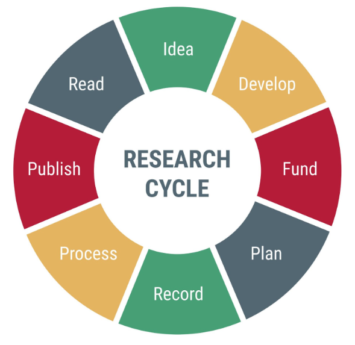

# Module 0: Introduction (15 minutes)

**Facilitator:** Mónica Muñoz Torres, Bridge Center

## Content Block (15 minutes)

### Key Message 1: Welcome & Context (5 minutes)

**Facilitator Note:** Start by grounding the workshop in reality. We aren't here just to talk about getting along; we are here because modern science demands scale.

- **Who We Are:** Name title, your role in navigating complex scientific landscapes.
    - Pamela Foster, Colleen Cuddy, Yulia Levites Strekalova, Jamie Toghranegar, Christine Velez, Grace Gonzalez, Jake Chen, Janani Ravi, Mónica Muñoz Torres (in person)
    - Sara Singer, Sean Davis (online)
- **The Bridge2AI Context:** Introducing the Bridge2AI initiative. It is not just a grant; it's a massive experiment in generating AI-Ready data. This requires a level of coordination that traditional _"hero science"_ (the lone genius) simply cannot support.
- **Objective:** _We are here today because the problems we want to solve—in health, genomics, and informatics — are now too complex for any single discipline to solve alone. This workshop is a toolkit for thriving in that multidisciplinary reality._

### Key Message 2: Calibrating the Room (Expectations & Ice-Breaker) (3 minutes)

**Facilitator Note:** Shift the energy from listening to participating immediately.

- **The Ask:** Before we show you our roadmap, we want to know where you are trying to go.
- **Prompt:** Go around the room using a live poll. Ask: _What is one friction point in your current collaborations that you hope to solve today?_ (e.g., miscommunication, unclear roles, slow data sharing).
- **The Ice-Breaker:** Validate their struggles. If you're frustrated by email chains or confused about authorship, you are in the right place.

### Key Message 3: Defining the Spectrum of Collaboration (2 minutes)

**Facilitator Note:** Move from the personal to the structural. Help them see that collaboration isn't one thing; it's a spectrum.

- **Micro:** Acknowledge the traditional model: 2–3 colleagues from the same department working on a paper. The communication cost is low; the shared language is high.
- **Macro (Consortium):** Contrast this with the reality of Bridge2AI. This is Team Science at scale—hundreds of researchers across different institutions, time zones, and vocabularies (e.g., clinicians vs. coders).
- **Gap:** The habits that work for the 'Micro' (informal chats in the hallway) will cause the 'Macro' to collapse. Today is about building the infrastructure for the Macro.

### Key Message 4: Core Philosophy: Innovation Requires Infrastructure (2 minutes)

**Facilitator Note:** This is the Why. Connect their desire for scientific success directly to the concept of Teaming.

**The Logic Chain:** Walk them through this deduction:
- **Goal:** We conduct research to achieve **Innovation** and **Significance**.
- **Requirement:** Innovation at the biomedical frontier requires **All Expertise** (genomics + ethics + CS + stats). Pillars: Data and Ethics
- **Mechanism:** Accessing that expertise requires **Teaming**. Pillar: **People**
- **Conclusion:** We don't build teams to be social; we build them to be successful. _**An environment that supports Teaming is an environment that supports Discovery.**_

### Key Message 5: Framework: The Research Life Cycle (Wheel) (2 minutes)

**Facilitator Note:** Introduce the visual anchor for the day. This Wheel demonstrates that Team Science isn't a separate activity; it powers every stage of the research. 

**Visualizing the Cycle:** Present the Research Life Cycle as a wheel, not a line.
- **Ideation:** Where diverse perspectives spark the initial question.
- **Funding/Planning:** Where governance and roles are defined.
- **Data Generation:** Where protocols and standardization (FAIR, CARE, ELSI, etc.) matter.
- **Analysis:** Where interdisciplinary translation happens.
- **Dissemination:** Where authorship and credit are navigated.

### Key Message 6: Takeaway (1 minute)

As we move through the modules today, we are effectively moving around this wheel. Team Science is the grease that keeps this wheel turning. If the team breaks, the cycle stops.

[Slides and materials can be found here](<materials/Module-0/>)