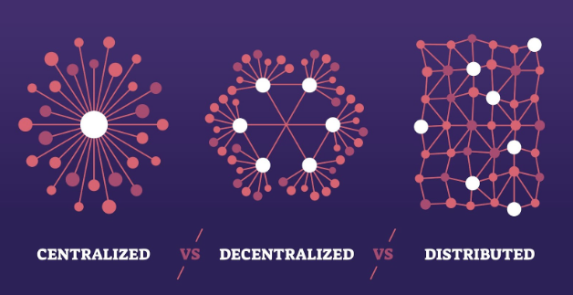

# Module 3: Governance and Leadership Models (40 minutes)

**Facilitator:** Jake Chen, Functional Genomics (CM4AI)

## Learning Objectives

By the end of this module, participants will be able to:

1. Distinguish between traditional hierarchical, distributed, and network governance models and describe when each is appropriate.
2. Map the decision-making layers in a large research consortium (working group → steering committee → program officials → funder).
3. Identify where within a given governance structure they have meaningful agency to influence outcomes.
4. Articulate the tradeoff between control (protecting project integrity) and freedom (enabling scientific creativity) in consortium governance.

## Module Overview

Governance sounds like an administrative concern — the province of directors and program officers, not scientists. But every researcher in a large consortium is already operating inside a governance structure, whether or not they know it. That structure determines who can approve a data release, who needs to sign off before a paper is submitted, and who is empowered to resolve a conflict between two teams. Scientists who don't understand the governance structure around them waste enormous time routing decisions to the wrong people, waiting on approvals that aren't needed, or — worse — making unilateral choices that create downstream conflicts.

This module provides a practical map of how governance works in large research consortia, using Bridge2AI as a concrete example. It introduces three governance models across a spectrum from centralized to distributed, then grounds the theory in the real experience of the people who actually navigate these structures every day. The fishbowl format is chosen deliberately: it allows participants to observe authentic conversation about governance challenges, including the tensions and ambiguities that polished presentations would smooth over.

## Participant Background Reading

Participants are encouraged to review the following before the session. Each takes 10–20 minutes.

- **A primer on how NIH Common Fund consortia are structured.** Before the session, review how large NIH-funded consortia typically organize themselves — particularly the roles of steering committees, working groups, program officials, and External Scientific Panels. The NIH Common Fund website (commonfund.nih.gov) and published consortium papers (which typically include a governance section) are good sources. Participants who already work in Bridge2AI should review their specific consortium's governance charter if available.

- **An accessible overview of distributed or shared leadership.** The module references distributed leadership as an alternative to traditional hierarchy. Before arriving, read a short accessible piece — a blog post, magazine article, or book excerpt — that describes what distributed leadership looks like in practice. This could be from a science management context (e.g., an essay on running an open-source scientific project) or a general organizational context.

## Instructor Notes

### Conceptual Background

**Three governance models and their tradeoffs.**
- *Traditional hierarchy* concentrates decision-making authority at the top. It is efficient when decisions are routine and well-defined, and when speed matters more than buy-in. It fails when the people at the top lack the specialized knowledge to make good decisions, or when the chain of command creates bottlenecks in fast-moving science.
- *Distributed leadership* allocates authority by expertise rather than position. It requires high trust among team members and clear norms about who has authority over what. It is well-suited to interdisciplinary teams where no single person can have deep expertise in all areas. The risk is ambiguity: if authority boundaries aren't explicit, decisions fall into gaps or get made twice by different people.
- *Network governance* — hub-and-spoke or web-like structures — is common in large data consortia like Bridge2AI, where semi-autonomous subgroups (centers, cores, working groups) need to coordinate without a single unified command. Provan & Kenis (2008) identify three forms of network governance: participant-governed (all members share governance), lead-organization-governed (one member coordinates on behalf of others), and network administrative organization (a separate entity governs the whole). Many NIH consortia use hybrid forms.

**Agency vs. awareness: a key pedagogical move.** This module makes an important distinction between macro-structure (the consortium's overall governance, which participants typically cannot change) and micro-structure (the governance of their specific working group or subteam, which they often *can* shape). This reframe is essential to prevent learned helplessness: participants should leave feeling empowered to act on what they can influence, not overwhelmed by what they cannot.

**Facilitating the fishbowl.** The fishbowl format is pedagogically powerful because it models authentic conversation rather than polished presentation. Key facilitation moves:
- The *empty chair* is an explicit invitation for audience members to enter the conversation. Facilitators should name this at the start and gently encourage participation if no one volunteers.
- Keep the conversation focused on *how* decisions get made, not just *what* decisions are made — the process, not the output, is what participants need to observe.
- Draw out disagreements and tensions gently. "It sounds like you and [other panelist] have different views on this — can you both say more?" is a useful prompt.
- Close by asking each panelist: "What do you wish you had known about this consortium's governance when you first joined?"

### Key Concepts

- **Governance:** The systems, processes, and norms by which decisions are made and authority is allocated within an organization or collaboration.
- **Traditional hierarchy:** A governance model with a clear, top-down chain of command and centralized decision-making authority.
- **Distributed leadership:** A governance model in which authority is allocated by expertise rather than position, with multiple people holding decision-making power in their domains.
- **Network governance:** A governance model suited to consortia and partnerships, in which semi-autonomous units coordinate through shared norms, liaison roles, or a coordinating body rather than a unified chain of command.
- **Working group:** A subunit of a consortium responsible for a specific area of work (e.g., data standards, ethics, a specific use case). Typically has its own internal governance.
- **Steering committee:** A consortium-level body with broad oversight and decision-making authority across working groups.
- **Agency vs. awareness:** The distinction between understanding a governance structure (awareness) and having the ability to change it (agency). Participants may have limited agency over macro-structure but meaningful agency over micro-structure.

### Recommended Instructor Reading

- Provan, K. G., & Kenis, P. (2008). "Modes of Network Governance: Structure, Management, and Effectiveness." *Journal of Public Administration Research and Theory*, 18(2), 229–252. The foundational typology of network governance forms; provides theoretical grounding for the "network governance" model introduced in this module.
- Pearce, C. L., & Conger, J. A. (Eds.). (2003). *Shared Leadership: Reframing the Hows and Whys of Leadership*. SAGE. Referenced in the original workshop materials as a resource on distributed leadership.
- Zuckerman, H. (1977). *Scientific Elite: Nobel Laureates in the United States*. Free Press. For historical context on the "hero science" model and its relationship to hierarchical governance in academic science — useful background for the Agency vs. Awareness discussion.

---

## Content Block (10 minutes)
_(Narrative Arc: A Maze, a Map, and the Guides)_

### Context: Navigating the Layers of Management (3 minutes)

- **Hook:** In a single-lab environment, you usually have one boss (the PI) and a straight line to decision-making. In a massive consortium like Bridge2AI, **_that straight line becomes a maze_**.

- **Reality:** We need to visualize the _vertical_ depth of these projects. Decisions pass through multiple layers: from the working group to the steering committee, to the program officials, and finally to the funding agency (NIH).

**Goal:** Not everyone has to become an administrator. We are sharing this knowledge so scientists don't waste weeks waiting for a decision from the wrong person. At all times, we need to know who holds the keys.

### Theory: Overview of Models (5 minutes)

**Models:** Introduce the spectrum of governance, ranging from traditional to experimental.

  - _Traditional Hierarchy:_ Clear chain of command (efficient, but can bottleneck).

  - _Distributed Leadership:_ Authority spread by expertise (agile, but requires high trust).

  - _Network Governance:_ Hub-and-spoke models, common in large data consortia.
  

**Resource:** For those who want to dig deeper into the sociology of these structures, we have included key references in your workshop booklet (e.g., _Pearce & Conger on Shared Leadership)_.

### Reality Check: Agency vs. Awareness (2 minutes)

**A word of caution:** We don’t always get to choose one of these models. When we join a massive project like Bridge2AI, the governance structure is likely already _set in stone (maybe!)_.

**Lesson:** We cannot always negotiate the _macro-structure_ (the Consortium), but we _can_ often influence the _micro-structure_ (our specific working group). **_Your goal is to understand the rules of the game so you can play it effectively, not necessarily to rewrite the rulebook._**

## Activity 3: Fishbowl Fireside Chat (30 minutes)

* **Format:** To illustrate what this looks like in the real world, we are moving into a 'Fishbowl' format.

  - _Setup:_ Chairs arranged in the center. One chair is left intentionally empty to encourage audience rotation/participation.

* **Moderator:** Introduce **Dr. Jake Chen**, who will guide the conversation, ensuring we probe the tension between structure and innovation.

* **Keynote Lead:** Introduce **Dr. Casey Greene**.

  - _Why him?_ Casey represents a modern approach to scientific leadership—open, decentralized, and highly effective. We want to hear how he leads without stifling creativity.

* **Institutional Context:** Introduce the Bridge2AI representatives (**Pamela Foster, Colleen Cuddy, Yulia Levites Strekalova, and Jamie Toghranegar**).

  - _Role:_ They represent the connective tissue of the consortium—the people who ensure the disparate parts actually talk to one another.
  
**Objective:** We will watch them discuss how decisions actually get made. Pay attention to how they balance the need for _control_ (to keep the project safe) with the need for _freedom_ (to let the science happen).

---

**Module Materials**

- [Slides (PDF)](https://github.com/bridge2ai/teaming-training-workshop/blob/main/materials/Module-3/Module-3-Slides.pdf)