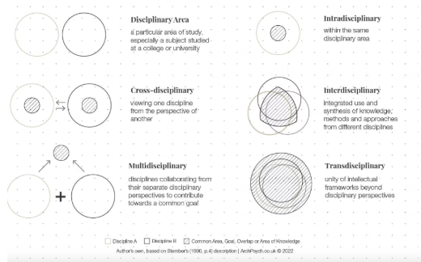
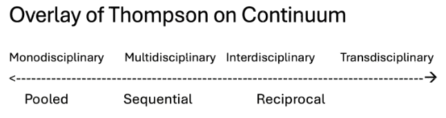

# Module 5: Effective Interdisciplinary Teams (40 minutes)

**Facilitator:** Colleen Cuddy, Salutogenesis (AI-READI)

***

**Module objective:** To provide participants with frameworks for understanding interdisciplinary teams and encourage them to develop strategies to improve their own team's effectiveness.

## Content Block: The Foundation for Effective Interdisciplinary Teams (10 minutes)

### **Why this matters:**

Complex scientific problems demand diverse perspectives

1. Multidisciplinary teams outperform homogeneous teams on complex problems (Page, 2007)

2. Multidisciplinarity alone isn't enough - inclusion practices determine whether engaging a broader scope of disciplines helps or hurts (Nishii, 2013)

3. Small changes in process can have big impacts on who participates and how (Woolley, 2010)

### Understanding Different Types of Team Composition

#### Levels of Heterogeneity

**Surface-Level Heterogeneity:**

- Demographics: gender, race, age, nationality
- Disciplinary backgrounds
- Institutional affiliations
- Career stages

**Deep-Level Heterogeneity:**

- Thinking styles (analytical vs. intuitive)
- Work preferences (individual vs. collaborative)
- Communication styles (direct vs. indirect)
- Risk tolerance (conservative vs. experimental)
- Skillsets (technical vs interpersonal)

### Continuum of monodisciplinary to transdisciplinary

- **Monodisciplinary:** Working within a single field.
- **Interdisciplinary:** Multiple disciplines work together, integrating their approaches to create new, synthesized knowledge.
- **Multidisciplinary:** Multiple disciplines work in parallel from their own perspectives.
- **Transdisciplinary:** Transcends disciplinary boundaries to create a new, shared conceptual framework.

### Thompson’s Interdependence & Coordination

Thompson (1967) provides a framework for the coordination of work based on levels of interdependence. 

| Types of Interdependence |  | Key Coordination Method |  |
|:---|:---|:---|:---|
| Pooled | Team members work independently and contribute their separate pieces to a common goal. The output is the sum of their efforts. | Standardization | Relies on establishing common rules, procedures, and standards that all members follow. This ensures outputs are consistent and can be easily aggregated with minimal interaction |
| Sequential | The work flows in an assembly-line fashion. One person's or group's output becomes the input for the next person or group. | Planning & Scheduling | Focuses on creating schedules and timelines to manage the flow of work between stages. The goal is to ensure smooth and timely hand-offs from one member to the next. |
| Reciprocal | Work is iterative and requires back-and-forth interaction. Each members output is an input for others, and vice-versa, in a dynamic process. | Mutual Adjustment | Requires constant communication. feedback, and shared decision-making. Team members continuously adapt their actions in response to others. This is the most intensive and demanding form of coordination. |

The further you move along the continuum, the more significant coordination becomes.

### Activity 5.a: Individual Reflection: (5 Minutes) 

Take a moment to think. How deep is your heterogeneity? Does your team have the diversity required to match the complexity of the work?
Where does your primary research team currently fall on this continuum? Where would you like it to be? Where does it need to be? 

## Content Block: What makes a good interdisciplinary team? Structure and Dynamics (10 minutes)

Two key frameworks help us create the conditions for success: one for the team's structure and one for its dynamics.

**The Structural Foundation (J. Richard Hackman's 5 Conditions)**

_Real Team:_ Clearly bounded, stable membership.

_Compelling Direction_: A clear, challenging, and consequential purpose.

_Enabling Structure:_ The right mix of people and clear norms of conduct.

_Supportive Context:_ Access to resources, information, and rewards for teamwork.

_Expert Coaching:_ Help with the process and removing roadblocks.

**Team Dynamics (Amy Edmondson's Principles)**

_Psychological Safety_: A shared belief that the team is safe for interpersonal risk-taking. People feel comfortable speaking up with ideas, questions, or mistakes.

_Inclusive Leadership:_ Leaders who actively invite and appreciate contributions from everyone.

_Deliberate Processes & Practices:_ Intentionally designing how the team communicates, makes decisions, and resolves conflict.

## Activity 5.b: Team Assessment & Discussion (13 minutes)

- Take a couple of minutes to reflect on your team and rank it based on Hackman and Edmonson’s Frameworks.
- Share your ranking with your neighbor, take turns, and discuss the following: 
    - Why did you choose these rankings? 
    - What are some things the team is doing well?
    - Where is there an area for growth?
    - What are some practices and processes that you might introduce?

[Slides and Handouts can be found here](https://drive.google.com/drive/folders/1J3vekxos_NEmfaxuKswpGyM1tD7cnOi3?usp=drive_link)